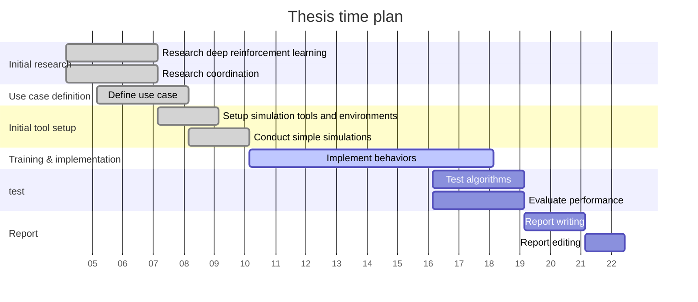

# Master project

```mermaid
gantt
    title Thesis time plan
    dateFormat  YYYY-MM-DD
    axisFormat %W
    section Initial research
    Research deep reinforcement learning        :done, a1, 2022-01-31, 3w
    Research coordination                       :done, a2, 2022-01-31, 3w
    section Use case definition
    Define use case                             :done, a3, 2022-02-07, 3w
    section Initial tool setup
    Setup simulation tools and environments     :done, a4, 2022-02-21, 2w
    Conduct simple simulations                  :done, a5, 2022-02-28, 2w
    section Training & implementation
    Implement behaviors                         :active, a6, after a5, 8w
    section test
    Test algorithms                             :a7, 2022-04-25, 3w
    Evaluate performance                        :a8, 2022-04-25, 3w
    section Report
    Report writing                              :a9, after a8, 2w
    Report editing                              :a10, after a9, 2022-06-08
```

