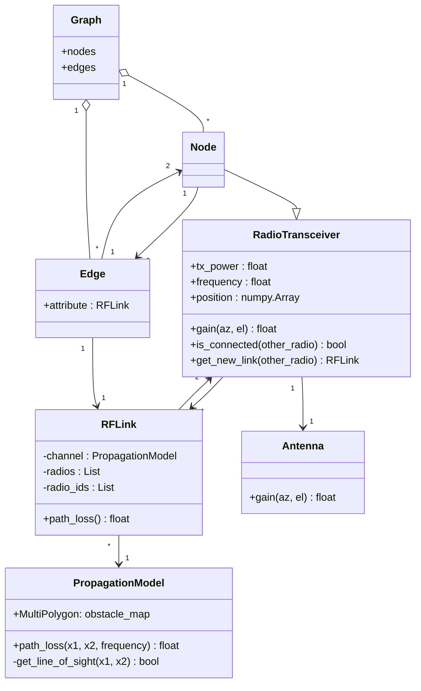
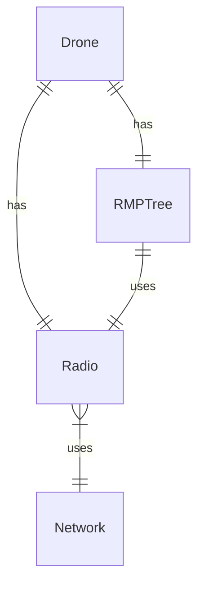

We are currently considering how to implement radio communication. This is a reliminary suggestion for how we might implement it.

# Class diagram of the RF simulation environment

The network `Graph` consists of nodes and edges (connections) between nodes. The nodes in the Networkx package can be any hashable type (strings, numbers, user defined objects). In this case the nodes are `RadioTransceiver` objects. The edges can have user-defined attributes. A standard attribute is `'weight'`, which can be used by the Networkx implementation of Dijkstra's algorithm and others. Here, an `RFLink` is used as an attribute of the edge. Each `RFLink` is associated with the `RadioTransceiver`-nodes that define the edge.

The radio and RF links can exist without the network graph. We can possibly have a link between all radios and only add the viable connections to the network.

# Incorporation of high(er) level logic and radio communication into RMP
Some RMP nodes depend on knowing the position and in some cases velocities of other dornes. We want to make it so that the RMP nodes only update information about the other drone(s) if there is a direct or indirect connection to the other drone. We suggest implementing a drone class containing a radio, RMP nodes and possibly other high-level controllers and devices that may influence the behavior of the drone.

